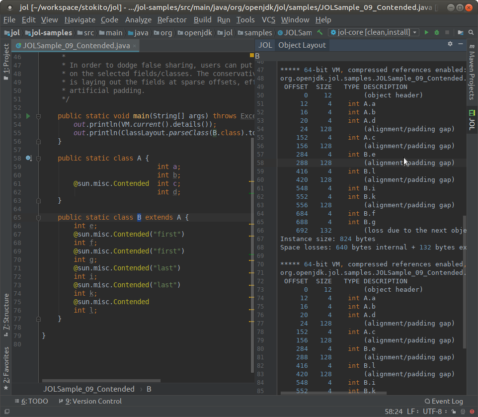

# Java Object Layout (JOL) plugin for IntelliJ Idea

[JOL](https://github.com/openjdk/jol/) (Java Object Layout) is the tool to analyze object layout schemes in JVMs.
For example, in HotSpot VM on 64x processor an empty string takes 40 bytes i.e. 24 bytes for String object itself + 16 bytes for an internal empty char array.

The plugin is a GUI for JOL and allows you to make an estimate how much memory the object takes.

Set a cursor into a class name and then press `Code / Show Object Layout` and you'll see a right panel with layout info.



Thus, you can perform simplest but most efficient performance improvements.
Just check your DTOs if they fit into 64 bytes of processor's cache line.

Only HotSpot VM is supported by JOL itself.
The plugin supports only basic estimate of class layout in different VM modes i.e. the same as `jol-cli estimates` command.
For more precise estimate use JOL library and estimate in run time on the real objects with `GraphLayout`:

```java
import org.openjdk.jol.info.GraphLayout;
import java.util.HashMap;

public class JolTest {

    public static void main(String[] args) {
        HashMap<Object, Object> hashMap = new HashMap<>();
        hashMap.put("key", "value");
        System.out.println(GraphLayout.parseInstance(hashMap).toFootprint());
    }
}
```

Output will be like:

    java.util.HashMap@7a79be86d footprint:
         COUNT       AVG       SUM   DESCRIPTION
             2        24        48   [B
             1        80        80   [Ljava.util.HashMap$Node;
             2        24        48   java.lang.String
             1        48        48   java.util.HashMap
             1        32        32   java.util.HashMap$Node
             7                 256   (total)

So you can see the full size including inner objects.

**NOTE:** Your app most likely will use the HotSpot with `64-bit VM, compressed references` mode. 

## Install the plugin
Open File / Settings / Plugins  then type `JOL` in search input and press `Browse in repositories` button.


### Inspection
The plugin provides an inspection to see most big classes. It's enabled by default.
You can find the inspection by path `Java | Memory | JOL: Class has too big memory footprint` to configure or disable it. 

Please rank the [Plugin](https://plugins.jetbrains.com/plugin/10953-java-object-layout) to make it more searchable.

## Related projects

Heap dump `*.hprof` files analysers:
 * [The Lightweight Java Visualizer (LJV)](https://github.com/atp-mipt/ljv) a tool for visualizing Java data structures 
 * The IntelliJ IDEA has a built-in [heap dump analyser](https://www.jetbrains.com/help/idea/analyze-hprof-memory-snapshots.html#read-snapshot)
 * Eclipse [Memory Analyzer (MAT)](https://www.eclipse.org/mat/)
 * [VisualVM](https://visualvm.github.io/) can also monitor heap in real time. Based on NetBeans
 * [Java Mission Control](https://github.com/openjdk/jmc)
